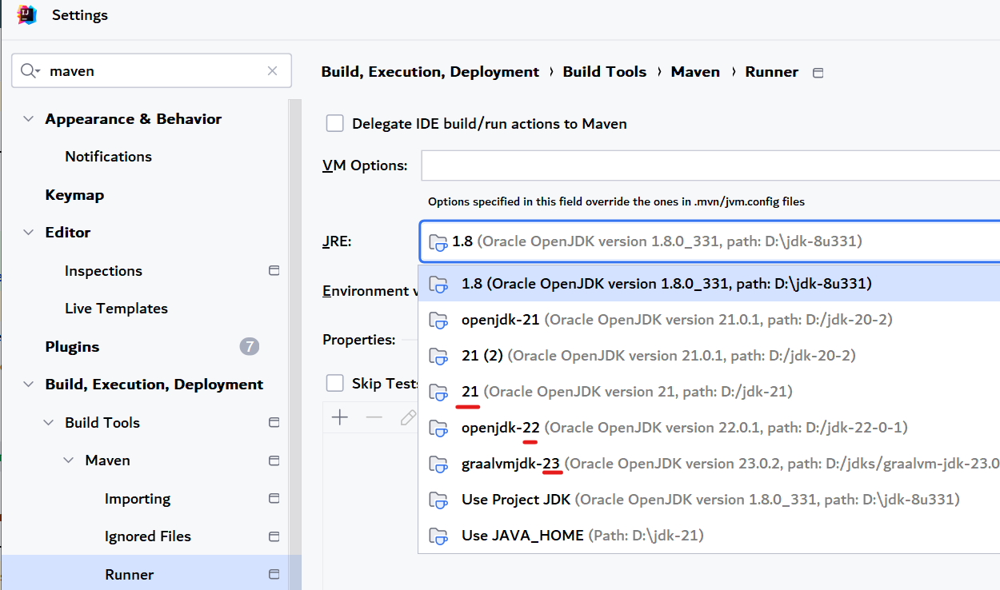

# DCheck

1. java 文本文件查重库
2. 基于语义（Embedding）的查重方法
3. 支持常见文本文件：txt、pdf、Office文件等

## 1. 快速开始

##### 1.1 编译与安装

maven编译条件：

1. jdk(jre) 版本 >= 21
2. 模块```DCheck-Impl-RelevancyEngine-EmbeddedNeo4j```的jdk版本>=17，其它模块>=8 <br>
   （不同jdk是为了兼顾适配国内主流jdk与java前沿生态）

3. 在IDEA中，使用```All Release```运行脚本或者使用命令行：<br>
   进入到项目根目录
    ```shell
    mvn install -f pom.xml -Prelease -DskipTests
    ```

##### 1.2 安装依赖

```xml
<?xml version="1.0" encoding="UTF-8"?>
<project xmlns="http://maven.apache.org/POM/4.0.0"
         xmlns:xsi="http://www.w3.org/2001/XMLSchema-instance"
         xsi:schemaLocation="http://maven.apache.org/POM/4.0.0 http://maven.apache.org/xsd/maven-4.0.0.xsd">
    <modelVersion>4.0.0</modelVersion>

    <groupId>org.example.my-project</groupId>
    <artifactId>quick-start</artifactId>
    <version>0.0.1</version>

    <properties>
        <java.version>1.8</java.version>
        <dcheck.version>0.0.1</dcheck.version>
    </properties>

    <dependencies>
        <!-- 提供DCheck查重框架 -->
        <dependency>
            <groupId>org.example.dcheck</groupId>
            <artifactId>DCheck-API</artifactId>
            <version>${dcheck.version}</version>
        </dependency>
        <!-- 使用一款提供RelevancyEngine实现的库（使用java spi机制），请注意，只需要选择一个实现库即可 -->
        <!-- 如果你运行的jre版本低于17，则使用这该库 -->
        <dependency>
            <groupId>org.example.dcheck</groupId>
            <!-- 该库需要准备额外环境 -->
            <artifactId>DCheck-Impl-Default-RelevancyEngine</artifactId>
            <version>${dcheck.version}</version>
        </dependency>
        <!-- 如果你运行的jre版本>=17, 则使用这该库 -->
        <dependency>
            <groupId>org.example.dcheck</groupId>
            <artifactId>DCheck-Impl-RelevancyEngine-EmbeddedNeo4j</artifactId>
            <version>${dcheck.version}</version>
        </dependency>
        <!-- 选择一款Reranker实现库，可选 -->
        <dependency>
            <groupId>org.example.dcheck</groupId>
            <!-- 该库需要准备额外环境 -->
            <artifactId>DCheck-Impl-Default-Reranker</artifactId>
            <version>${dcheck.version}</version>
        </dependency>
        <!-- 选择一款Codec实现库 -->
        <dependency>
            <groupId>org.example.dcheck</groupId>
            <artifactId>DCheck-Impl-Codec-Gson</artifactId>
            <version>${dcheck.version}</version>
        </dependency>
    </dependencies>
</project>
```

##### 依赖安装须知

1. 选择```DCheck-Impl-Default-RelevancyEngine```还是```DCheck-Impl-RelevancyEngine-EmbeddedNeo4j```
   作为你的RelevancyEngine实现库，取决于以下要素：

    1. DCheck-Impl-Default-RelevancyEngine
        1. 系统资源（内存）较为充足
        2. 需要python环境(>=3.11)，愿意参照[该项目](https://gitee.com/GiteeHuanyu/DCheck-Impl-ChromaRelevancyEngine)
           的指导预先准备环境
    2. DCheck-Impl-RelevancyEngine-EmbeddedNeo4j
        1. jdk(jre) 版本 >= 17
        2. 系统资源（内存）较为紧张
        3. 想要快速启动用例不想准备额外环境

2. 启用```DCheck-Impl-Default-Reranker```的前提准备

   参照[该项目](https://gitee.com/GiteeHuanyu/DCheck-Impl-Default-Reranker)，```clone```到本地后，启动成功即可。需要cuda环境

3. 选择```Codec```实现库，目前只支持```Gson```库

##### 1.3 运行用例 (持续更新)

参照该类中的[测试用例](DCheck-Test/src/test/java/DcheckAggregateTest.java)

## Q&A 常见问题

可以去提交issue，重复的问题也会罗列在下

1. maven编译遇到报错： 无效的目标发行版: 17

   请更换maven运行时jdk。可以临时更改环境变量，将JAVA_HOME指向大于17的版本
   在IntelliJ IDEA中，可以在该界面下配置

     
